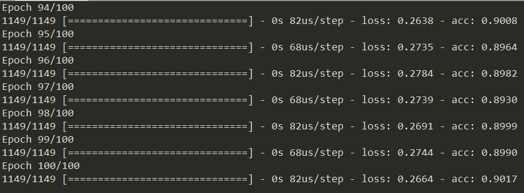
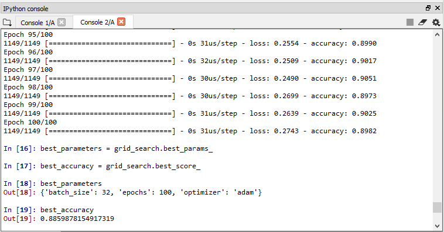

# Deep_Learning_Liver_Prediction
Deep Learning to predict donor-recipient matching for liver transplant


First try results for ann.py:


Results for grid search:


Inbalanced dataset:
- Survival 3 months post transplant: 1287
- Non-survival 3 months post transplant: 150
Total: 1437

TO DO:
- [] Random Forest variable importance
- [] Evaluation - compare datasets 
- [] Print the error of the predictions
- [] Make a line of best fit on the graphs 

```shell

$ conda install git

$ pip install --upgrade --no-deps git+git://github.com/Theano/Theano.git

$ pip install --user tensorflow

$ pip install --upgrade keras

$ conda install graphviz

$ conda install pydot

$ conda install pyplot
```

https://github.com/tensorflow/tensorflow/issues/27935

