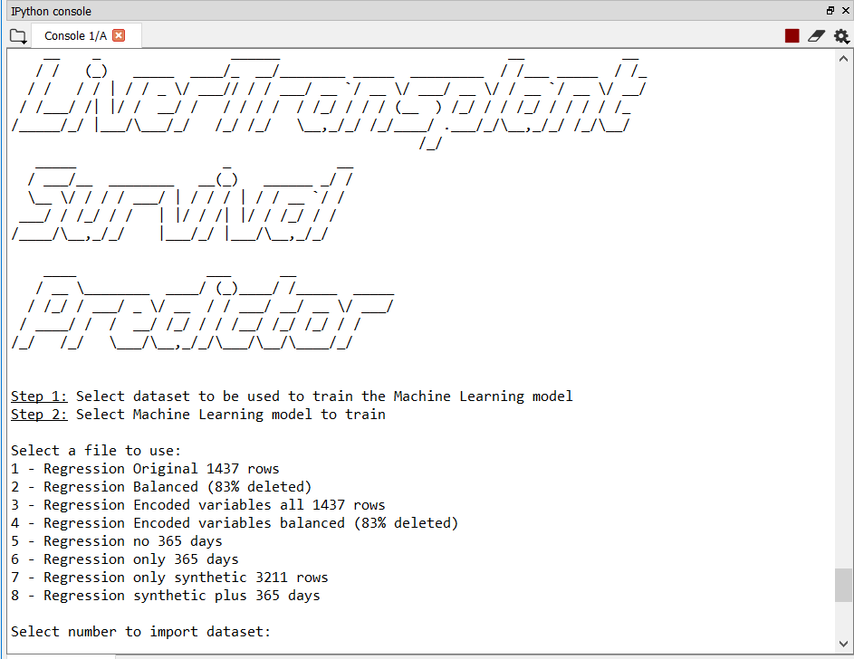
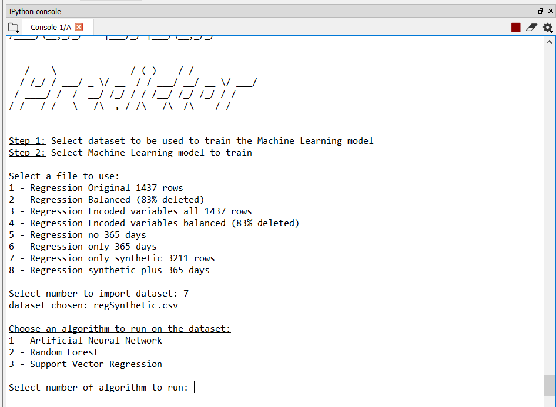
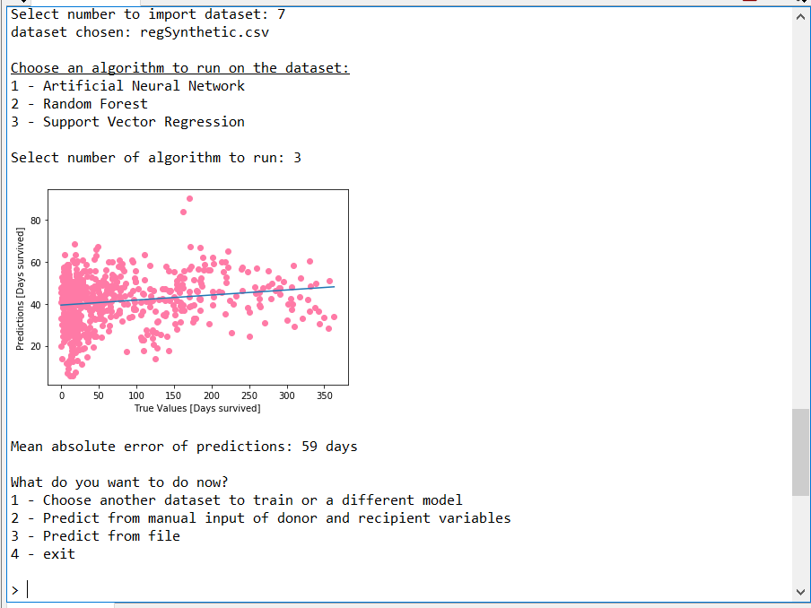
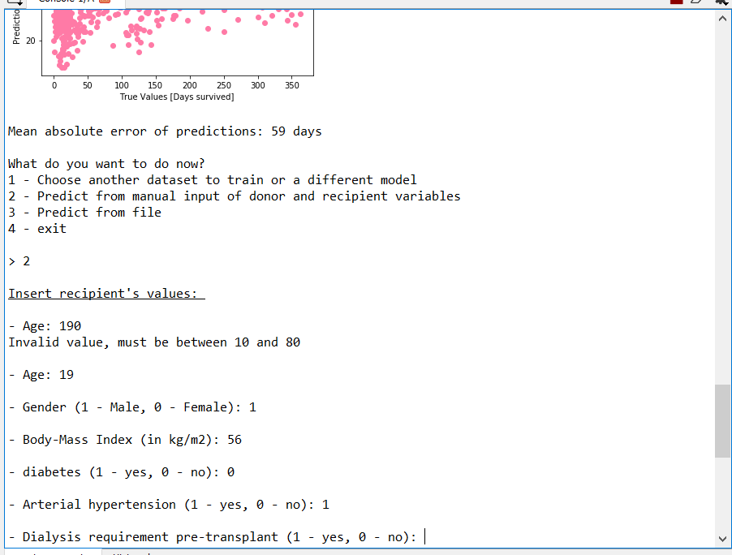
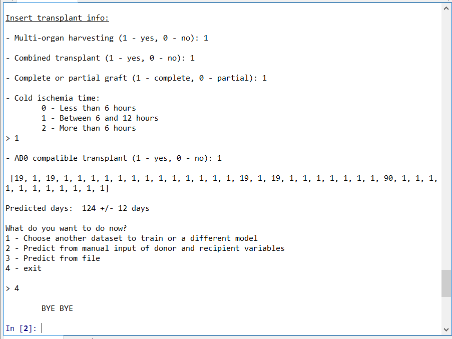
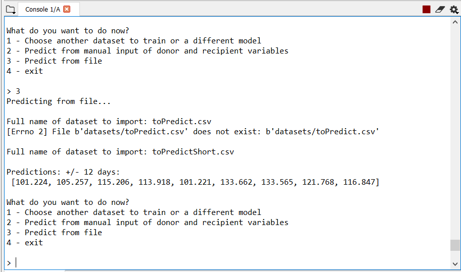
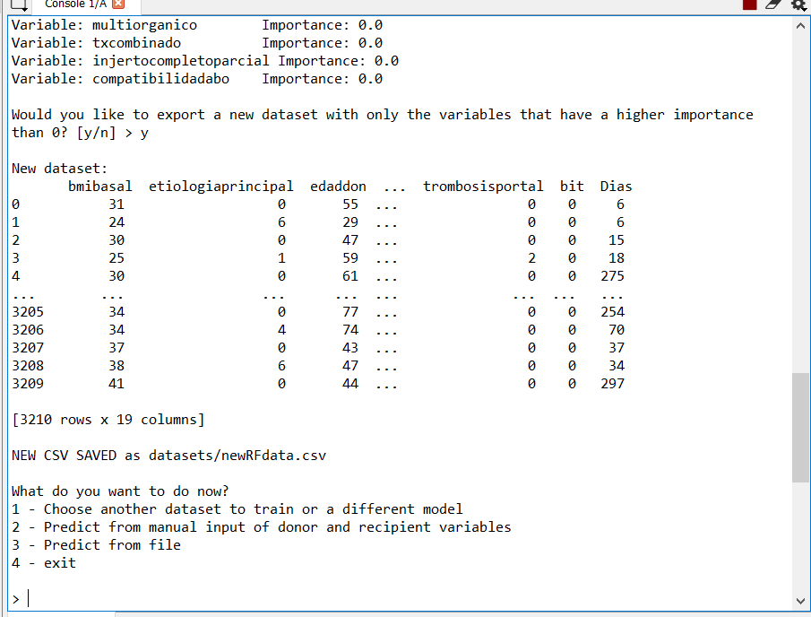

# Using Deep Neural Networks to predict survival rates of hepatic transplant recipients for each donor-recipient match

Environment: Anaconda - Spyder

```shell

$ conda install git

$ pip install --upgrade --no-deps git+git://github.com/Theano/Theano.git

$ pip install --user tensorflow

$ pip install --upgrade keras

$ conda install graphviz

$ conda install pydot

$ conda install pyplot
```














